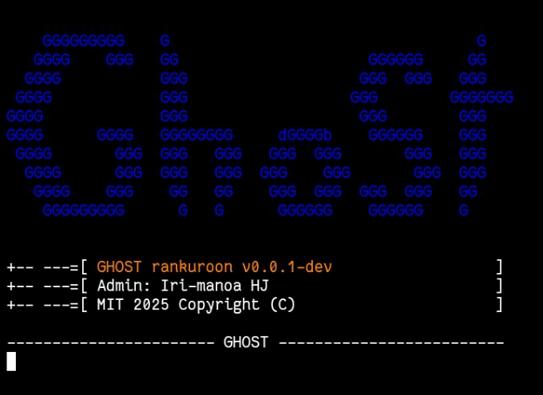

# Ghost-Cli

Tools for automating some tasks like ip-finder & geo-localisation in full CLI mood.

## 📚 Tables of Contents
- [Installation](#installation)
- [Usage](#usage)

## Installation
`pkg upgrade && pkg update`
`pkg install python pip`
`pip install request mechanize geopy`
`git clone https://github.com/CRI-AT/Ghost-Cli`

## Usage
`python major.py`